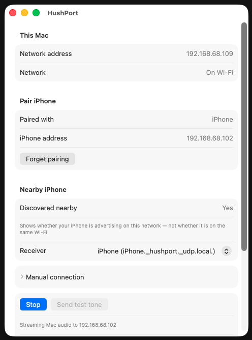
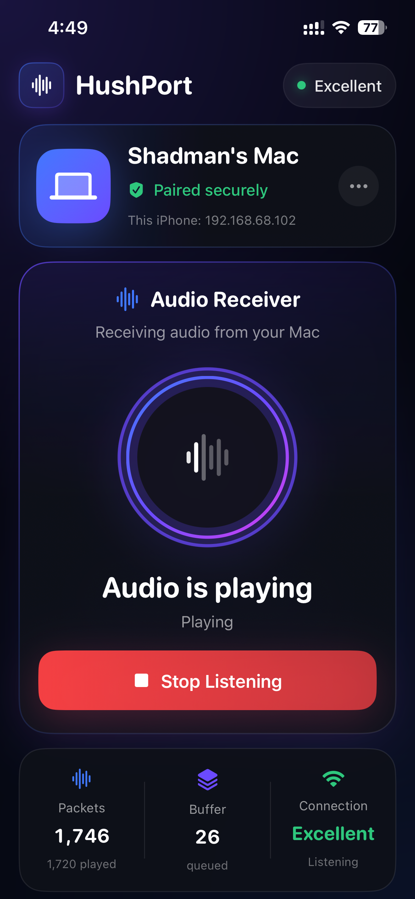
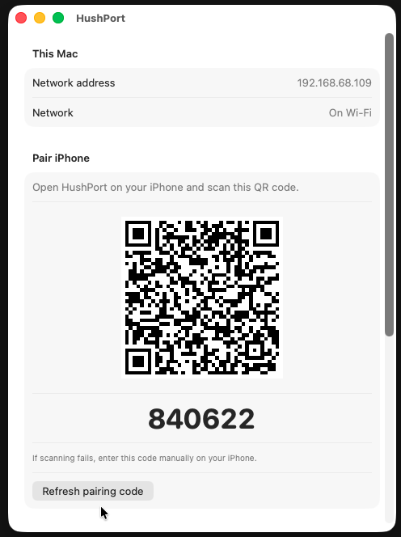
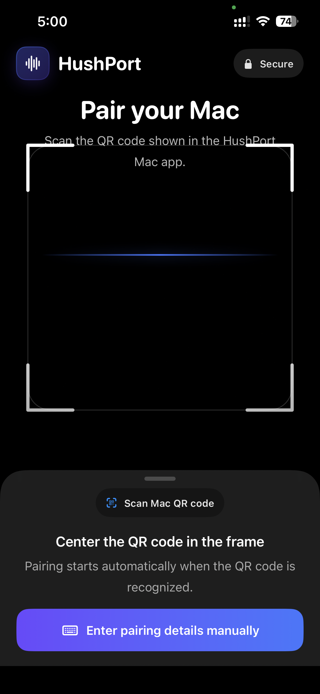
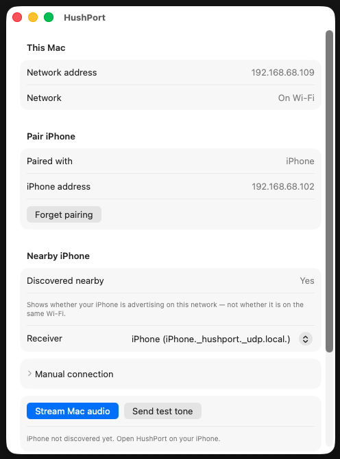
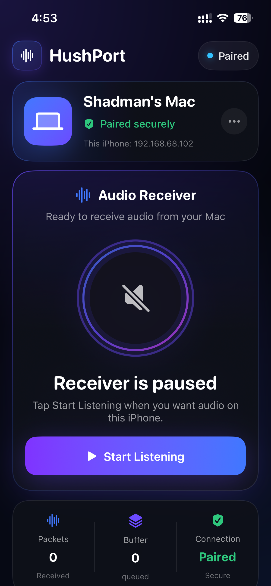
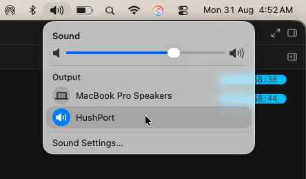
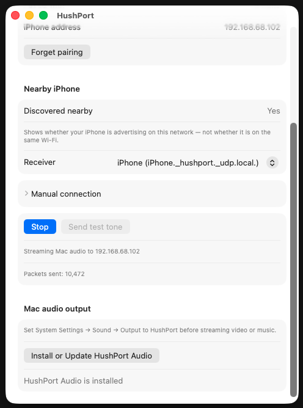

# HushPort


**Stream your Mac's audio to your iPhone.**

HushPort turns your iPhone into a wireless audio receiver for your Mac — over your local network. **No account. No cloud. No tracking.**

Your Mac. Your phone. Your earphones.

### How it works

1. Open **HushPort** on Mac and iPhone.
2. **Scan the QR code** to pair once.
3. On iPhone, tap **Start Listening**.
4. On Mac, tap **Stream Mac audio**.

> **Free public beta** — occasional audio dropouts or connection issues may occur. [Report issues](https://github.com/Devcollar/hushport/issues/new/choose) on GitHub.

**Website:** [devcollar.github.io/hushport](https://devcollar.github.io/hushport/)

<table>
  <tr>
    <td width="50%" valign="top" align="center">
      
    </td>
    <td width="50%" valign="top" align="center">
      
    </td>
  </tr>
</table>

---

## What it does

HushPort turns your iPhone into a wireless speaker for your Mac:

1. **Mac** captures system audio via a virtual output device (HushPort Audio).
2. **Mac** sends low-latency PCM audio to your iPhone over UDP on your LAN.
3. **iPhone** buffers and plays the stream on the built-in speaker or connected earphones.

Pair once with a QR code, then reconnect automatically on the same Wi‑Fi.

---

## Screenshots

### Pairing

<table>
  <tr>
    <td width="50%" valign="top">
      
      <br /><sub><b>Mac</b> — QR code and 6-digit pairing code</sub>
    </td>
    <td width="50%" valign="top" align="center">
      
      <br /><sub><b>iPhone</b> — scan to pair securely</sub>
    </td>
  </tr>
</table>

### Ready to stream

<table>
  <tr>
    <td width="50%" valign="top">
      
      <br /><sub><b>Mac</b> — paired, Bonjour discovery, stream controls</sub>
    </td>
    <td width="50%" valign="top" align="center">
      
      <br /><sub><b>iPhone</b> — paired and ready; tap Start Listening</sub>
    </td>
  </tr>
</table>

### Streaming

<p align="center">
  
  <br /><sub>Select <b>HushPort</b> as the Mac audio output in the menu bar or System Settings</sub>
</p>

<p align="center">
  
  <br /><sub><b>Mac</b> — live stream status and packet counter</sub>
</p>

---

## Features

- **One-time pairing** — QR code or 6-digit code
- **Auto-reconnect** — saved trust + Bonjour discovery on relaunch
- **Menu bar controls** — stream, mute, disconnect from the Mac menu bar
- **Adaptive playback** — jitter buffer, packet-loss concealment, latency trim on iPhone
- **System audio capture** — Core Audio HAL virtual output (`HushPort Audio`)
- **Local network only** — UDP transport with sequenced packets; no cloud relay
- **Background playback** — iPhone keeps listening while the app is in the background
- **Manual fallback** — enter iPhone IP if Bonjour is blocked

---

## Quick start

### Requirements

- macOS 14+ (Apple Silicon or Intel)
- iOS 17+ (iPhone)
- Both devices on the **same Wi‑Fi** (not guest or client-isolated networks)
- Xcode 15+ to build from source

### First-time setup

1. Build and run **`HushPortMacApp`** on your Mac.
2. Build and run **`HushPortIOSApp`** on your iPhone.
3. On **Mac**, open HushPort and note the QR code under **Pair iPhone**.
4. On **iPhone**, scan the QR code (or use **Enter pairing details manually**).
5. On **Mac**, click **Install or Update HushPort Audio**, restart if prompted.
6. Set **System Settings → Sound → Output → HushPort** (or pick HushPort from the menu bar Sound menu).

### Daily use

1. Open **HushPort on iPhone** → tap **Start Listening** (auto-starts when paired).
2. On **Mac**, click **Stream Mac audio** (main window or menu bar).
3. Listen on your iPhone. Use **Mute** or **Stop** on the Mac when finished.

If discovery fails, enter the iPhone IP shown in the iOS app (**This iPhone: …**) under **Manual connection** on the Mac.

Download and install instructions: **[docs/install.md](docs/install.md)** · **[Website](https://devcollar.github.io/hushport/)**

---

## Privacy

- Audio streams **directly** between your Mac and iPhone on the local network.
- **No** user accounts, cloud servers, or analytics in the current beta.
- Pairing trust is stored **locally** on each device.
- Source code is **public for inspection** under a [proprietary license](LICENSE) — viewable, not redistributable without permission.

---

## Known limitations (beta)

- **Same Wi‑Fi required** — guest or client-isolated networks often block device-to-device traffic.
- **Brief dropouts** may occur on busy or weak Wi‑Fi.
- **One Mac → one iPhone** per session (multi-receiver not supported yet).
- **System audio** requires **HushPort** selected as the Mac output (or use **Send test tone** to verify the link).
- **IP addresses can change** after a network switch — use manual IP or re-pair if discovery fails.
- **Long sessions** may develop slight audio delay; stop and restart listening to reset.
- **No encryption** on the wire yet — intended for trusted home networks only.

---

## How it works

| Layer | Details |
|-------|---------|
| **Audio** | 48 kHz stereo 16-bit PCM, 5 ms packets (960 bytes) |
| **Transport** | UDP port `49200` (audio), `49201` (control) |
| **Discovery** | Bonjour `_hushport._udp` |
| **Mac capture** | HAL plugin → shared ring buffer → paced send loop |
| **iPhone playback** | `AVAudioEngine` + adaptive jitter buffer |

For a full technical write-up, see **[docs/overview.md](docs/overview.md)**.

---

## Project structure

```
Sources/
  HushPortMac/          macOS sender app + menu bar
  HushPortIOS/          iOS receiver app
  HushPortCore/         Shared networking, protocol, buffering, pairing
  HushPortAudioPlugin/  Core Audio HAL virtual output
  HushPortRingBuffer/   C ring buffer between HAL and app
docs/
  overview.md           Architecture and protocol reference
  screenshots/          App screenshots
```

**Bundle IDs**

| Target | Bundle ID |
|--------|-----------|
| iOS | `com.devcollar.hushport` |
| macOS | `com.devcollar.hushport.mac` |
| HAL plugin | `com.devcollar.hushport.audio` |

---

## Development

```sh
swift test
open HushPort.xcodeproj
```

Run the **`HushPortMacApp`** scheme on your Mac and **`HushPortIOSApp`** on a physical iPhone (simulator cannot receive LAN audio streams from a Mac).

---

## Roadmap

- [ ] Encrypted audio and control sessions
- [ ] On-screen latency display
- [ ] Stronger long-session sync
- [ ] Notarized / App Store distribution

---

## License

Copyright © 2026 [Devcollar Private Limited](https://github.com/Devcollar). All rights reserved.

Source is **publicly visible for transparency** — not open source. See [LICENSE](LICENSE) for terms. Redistribution, modification, and commercial use require written permission.

---

## Status

**HushPort is a free public beta.** Built and tested on local Wi‑Fi. Bug reports and feedback welcome via [GitHub Issues](https://github.com/Devcollar/hushport/issues/new/choose).
